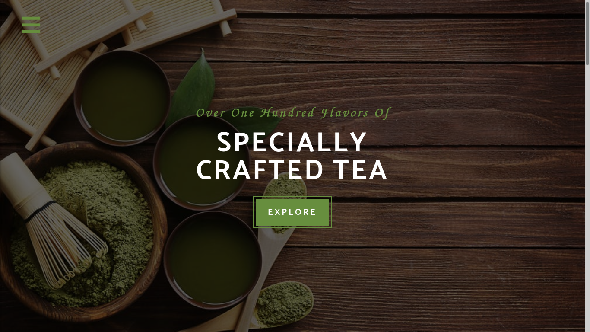

# Tea Station Project
 

 

## Learning Goals

During project work with basic technical a skills of the html and css, how:

<ul>
  <li>css variables</li>
  <li>text and box shadow</li>
  <li>semantic tags</li>
  <li>transform</li>
  <li>transition</li>
  <li>animation</li>
  <li>selectors</li>
  <li>positions</li>
  <li>media queries</li>
  <li>images</li>
  <li>colors</li>
  <li>typography</li>
</ul>
